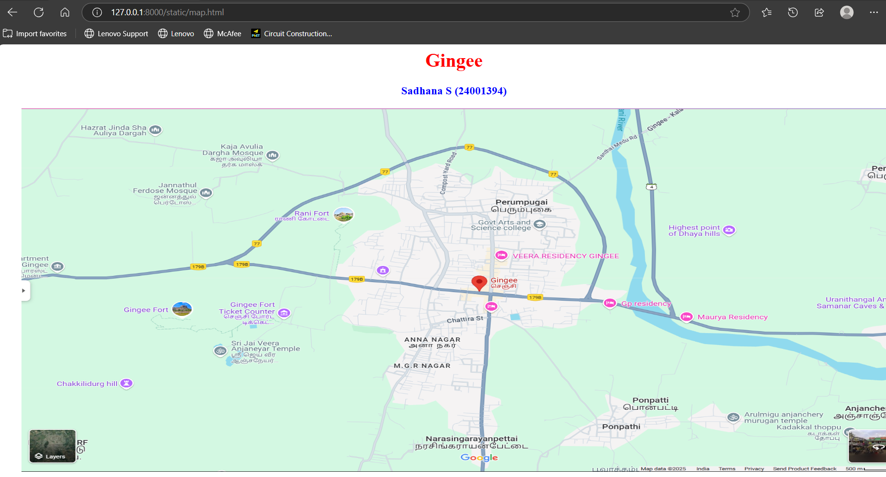
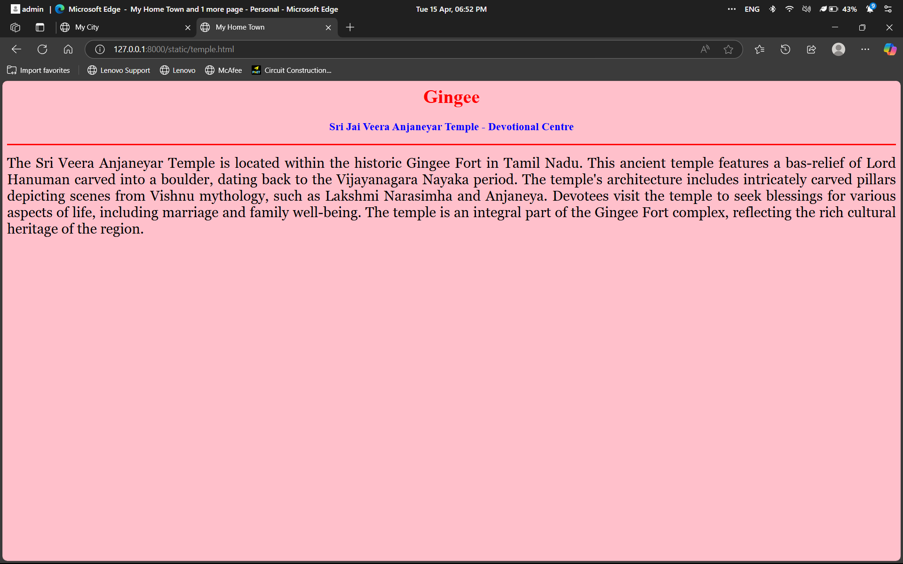
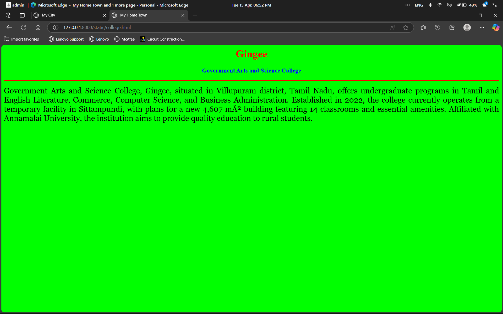
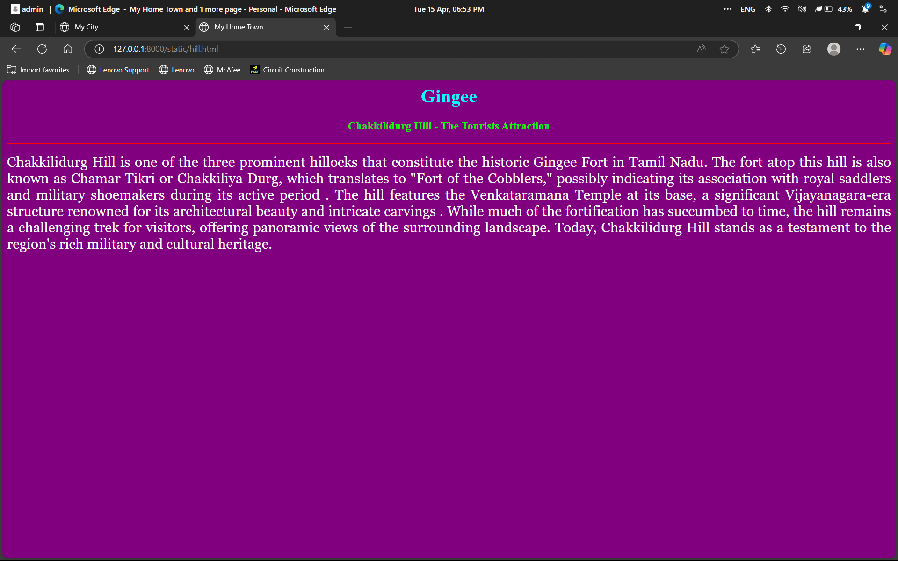
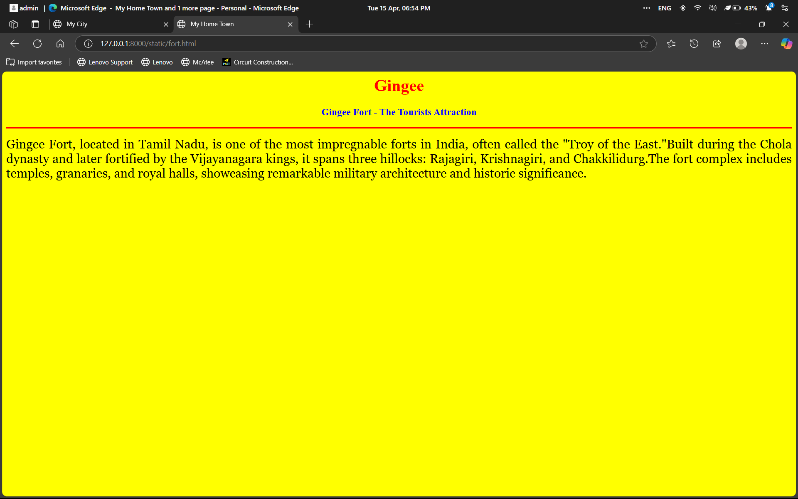
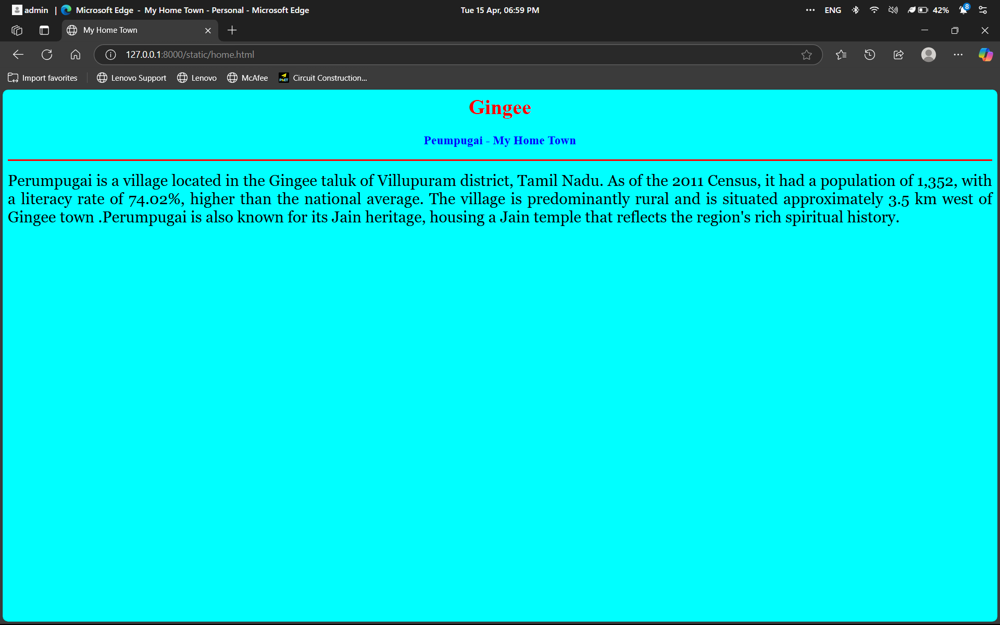

# Ex04 Places Around Me
# Date: 15.04.2025
# AIM
To develop a website to display details about the places around my house.

# DESIGN STEPS
## STEP 1
Create a Django admin interface.

## STEP 2
Download your city map from Google.

## STEP 3
Using <map> tag name the map.

## STEP 4
Create clickable regions in the image using <area> tag.

## STEP 5
Write HTML programs for all the regions identified.

## STEP 6
Execute the programs and publish them.

# CODE
```
map.html

<html>
    <head>
        <title>My City</title>
    </head>
    <body>
        <h1 align="center">
            <font color="red"><b>Gingee</b></font>
        </h1>
        <h3 align="center">
            <font color="blue"><b>Sadhana S (24001394)</b></font>
        </h3>
        <center>
            
            <map name="My City">
                <area shape="rect" coords="700,250,850,400" href="home.html" title="My Home Town">
                <area shape="circle" coords="570,230,45" href="temple.html" title="Sri Jai Veera Anjaneyar Temple">
                <area shape="circle" coords="640,200,30" href="hill.html" title="Chakkilidurg Hill">
                <area shape="circle" coords="1120,360,25" href="college.html" title="Government Arts and Scuence College">
                <area shape="rect" coords="950,120,1100,140" href="fort.html" title="Gingee Fort"
            </map>
        </center>
    </body>
</html>

home.html

<html>
    <head>
        <title>My Home Town</title>
    </head>
    <body bgcolor="cyan">
        <h1 align="center">
            <font color="red"><b>Gingee</b></font>
        </h1>
        <h3 align="center">
            <font color="blue"><b>Peumpugai - My Home Town</b></font>
        </h3>
        <hr size="3" color="red">
        <p align="justify">
            <font face="Georgia" size="5">
                Perumpugai is a village located in the Gingee taluk of Villupuram district, Tamil Nadu. 
                As of the 2011 Census, it had a population of 1,352, with a literacy rate of 74.02%, 
                higher than the national average. The village is predominantly rural and is situated 
                approximately 3.5 km west of Gingee town .Perumpugai is also known for its Jain heritage, 
                housing a Jain temple that reflects the region's rich spiritual history.
            </font>
        </p>
    </body>
</html>

temple.html

<html>
    <head>
        <title>My Home Town</title>
    </head>
    <body bgcolor="pink">
        <h1 align="center">
            <font color="red"><b>Gingee</b></font>
        </h1>
        <h3 align="center">
            <font color="blue"><b>Sri Jai Veera Anjaneyar Temple - Devotional Centre</b></font>
        </h3>
        <hr size="3" color="red">
        <p align="justify">
            <font face="Georgia" size="5">
                The Sri Veera Anjaneyar Temple is located within the historic Gingee Fort in Tamil Nadu. This ancient temple 
                features a bas-relief of Lord Hanuman carved into a boulder, dating back to the Vijayanagara Nayaka period. 
                The temple's architecture includes intricately carved pillars depicting scenes from Vishnu mythology, such 
                as Lakshmi Narasimha and Anjaneya. Devotees visit the temple to seek blessings for various aspects of life, 
                including marriage and family well-being. The temple is an integral part of the Gingee Fort complex, reflecting 
                the rich cultural heritage of the region.

            </font>
        </p>
    </body>
</html>

hill.html

<html>
<head>
    <title>My Home Town</title>
</head>
    <body bgcolor="purple">
        <h1 align="center">
            <font color="cyan"><b>Gingee</b></font>
        </h1>
        <h3 align="center">
            <font color="lime"><b>Chakkilidurg Hill - The Tourists Attraction</b></font>
        </h3>
        <hr size="3" color="red">
        <p align="justify">
            <font face="Georgia" size="5" color="white">
                Chakkilidurg Hill is one of the three prominent hillocks that constitute the historic Gingee Fort in Tamil Nadu. 
                The fort atop this hill is also known as Chamar Tikri or Chakkiliya Durg, which translates to "Fort of the Cobblers," 
                possibly indicating its association with royal saddlers and military shoemakers during its active period . The hill 
                features the Venkataramana Temple at its base, a significant Vijayanagara-era structure renowned for its architectural 
                beauty and intricate carvings . While much of the fortification has succumbed to time, the hill remains a challenging 
                trek for visitors, offering panoramic views of the surrounding landscape. Today, Chakkilidurg Hill stands as a testament 
                to the region's rich military and cultural heritage.
            </font>
        </p>
    </body>
</html>

college.html

<html>
    <head>
        <title>My Home Town</title>
    </head>
    <body bgcolor="lime">
        <h1 align="center">
            <font color="red"><b>Gingee</b></font>
        </h1>
        <h3 align="center">
            <font color="blue"><b>Government Arts and Science College</b></font>
        </h3>
        <hr size="3" color="red">
        <p align="justify">
            <font face="Georgia" size="5">
                Government Arts and Science College, Gingee, situated in Villupuram district, Tamil Nadu, offers 
                undergraduate programs in Tamil and English Literature, Commerce, Computer Science, and Business 
                Administration. Established in 2022, the college currently operates from a temporary facility in 
                Sittampundi, with plans for a new 4,607 m² building featuring 14 classrooms and essential amenities.
                Affiliated with Annamalai University, the institution aims to provide quality education to rural students.
            </font>
        </p>
    </body>
</html>

fort.html

<html>
    <head>
        <title>My Home Town</title>
    </head>
    <body bgcolor="yellow">
        <h1 align="center">
            <font color="red"><b>Gingee</b></font>
        </h1>
        <h3 align="center">
            <font color="blue"><b>Gingee Fort - The Tourists Attraction</b></font>
        </h3>
        <hr size="3" color="red">
        <p align="justify">
            <font face="Georgia" size="5">
                Gingee Fort, located in Tamil Nadu, is one of the most impregnable forts in India, often called 
                the "Troy of the East."Built during the Chola dynasty and later fortified by the Vijayanagara kings, 
                it spans three hillocks: Rajagiri, Krishnagiri, and Chakkilidurg.The fort complex includes temples, 
                granaries, and royal halls, showcasing remarkable military architecture and historic significance.
            </font>
        </p>
    </body>
</html>

```


# OUTPUT







# RESULT
The program for implementing image maps using HTML is executed successfully.
